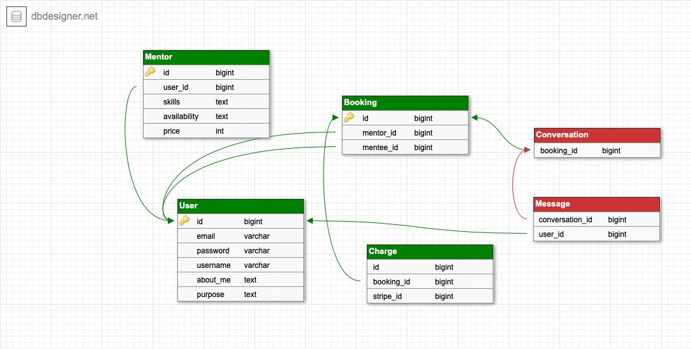
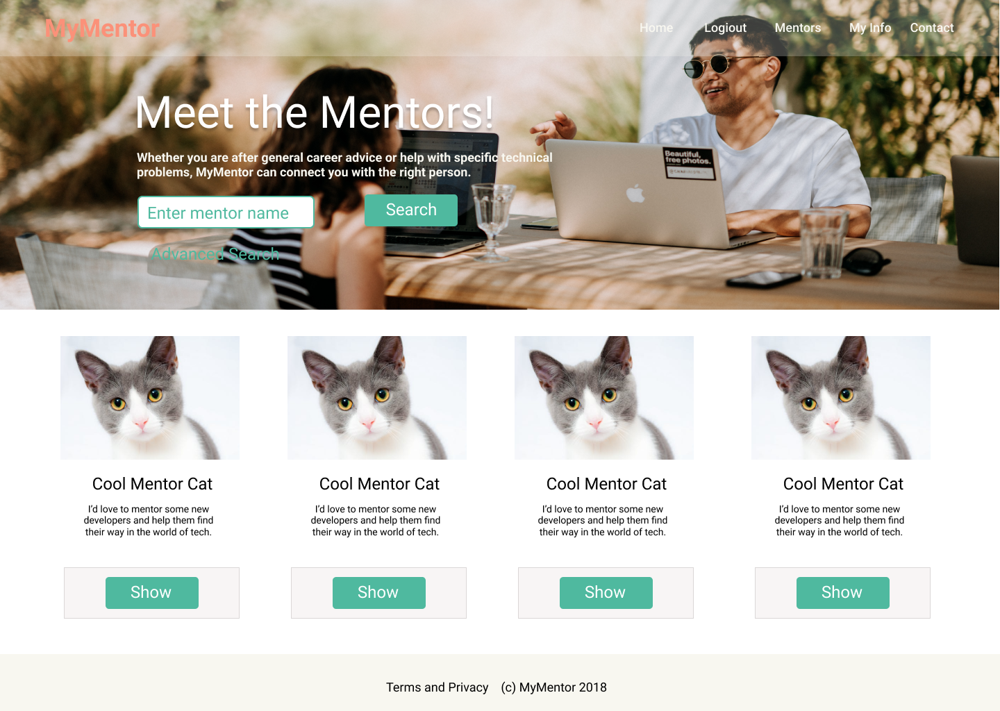
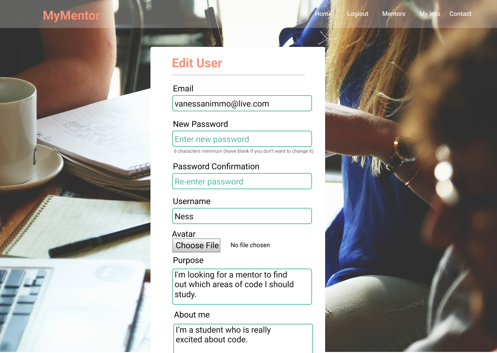
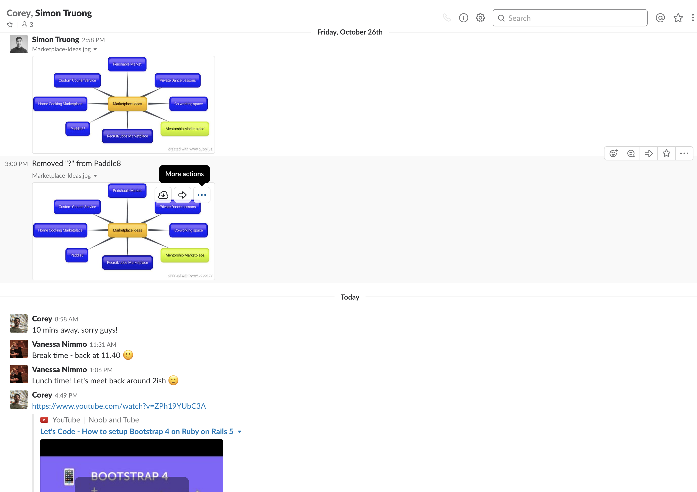
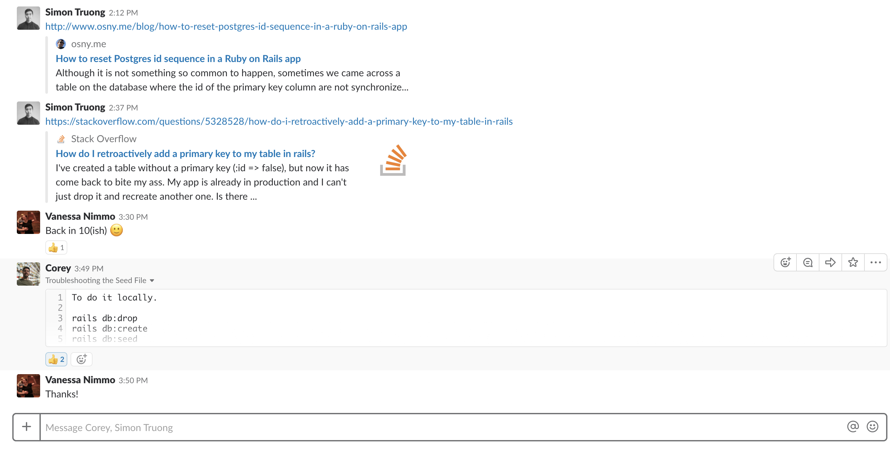
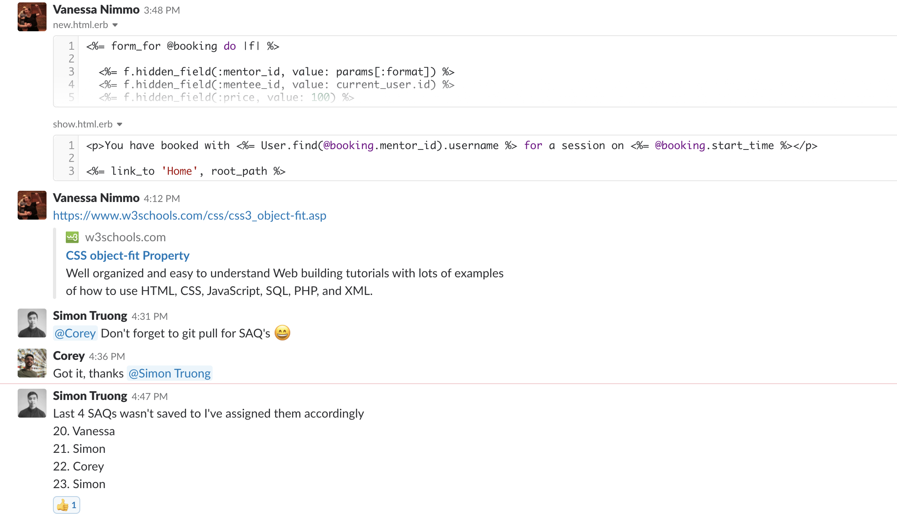
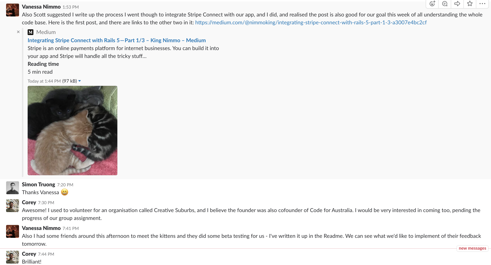

# MentorMe

[App deployed on Heroku] (https://techmentor.herokuapp.com/)

Rails App by Simon, Corey and Vanessa.

## Contents

[Working Info](#working-info)

[Short Answer Questions](#short-answer-questions)

[Design Planning](#design-planning)

[Inspiration](#inspiration)

[Team Communication](#team-communication)

## Working Info

**Workflow Info for Us**

## Git Workflow

We set the project up as a GitHub organisation, aiming to make the organisation repo the source of truth. When working on our own machines, we will start by doing the following:

- On branch master, do 'git pull'
- Create a new branch with: 'git checkout -b branch-name'
- Work on the new branch
- Commit to the new branch
- Push to the online repo with: 'git push origin branch-name'
- Checkout back to master
- Go into the GitHub repo and merge it into master 'new pull request'
- Delete the branch online if you don't need it anymore
- Do a git pull on the local machine
- Delete the local branch if you don't need it any more with 'git branch -d branch-name'

## Database Seeding

In order to use the seed file to populate our database we need to do the following:

    rails db:drop

    rails db:create

    rails db:migrate

    rails db:seed

## Heroku

- Deploy either in the morning or early in the afternoon as this is less stressful than at 4.45pm!

## Sprint Planning

Friday Oct 26 and Monday Oct 29

App Idea - To connect Mentors and Mentees in the Tech Industry in Melbourne.

Problems this app will solve:

• Hard to meet developers in the industry

• Hard to develop communication and management skills working in a highly technical enviroment

**User Personas:**

• Coder Academy student - John is a career changer and has recently finished a bootcamp course at Coder Academy. He is confused about what direction he should be taking and would like to sit down with an experienced developer to gain some career advice

• Senior Developer - Jane is a Senior Developer at a large company in Melbourne. She loves the idea of sharing her knowledge and giving back to the industry but doesn't know where to start

• Sarah is a freelance designer who works in website design. She would love to expand her network within the tech industry but is unsure of where or how to start

• Alex is currently learning to code online in his spare time. He is struggling with databases and would like help from a mentor to learn more about it one on one

• Javascript Developer - Alicia is a mid-level Javascript developer who has a few years experience working for a start-up. She currently works 3 days a week and loves the idea of supplementing her income by teaching code. She isn't a qualified teacher but has amazing skills in the area of Javascript. She would love to improve her communication and managing skills to help her move up in her own career

*NB: Also created user stories during this session, but have moved these down into question 15 of the SAQs*

**Team Meeting Thurs Nov 1st**

Bookings: do we want to go the route of sending an email, or do we want to go the route of allowing people to make full bookings on the website? Today is the time to decide which of those to push for. Could potentially go for email first to have some sort of record, then do the calendar afterwards. (Email is not MVP, but it would give us a simple solution to the booking problem which we could then build off.)

Decision: do emails first and then shoot for a booking system.

**User flow**

• Wireframes

• ERD

**Ethical Considerations:**

• User reviews

• Code of conduct

• Code of conduct violations

**Stripe Payment Discussion Friday Nov 2nd**

*Charging People with Stripe and Getting People Paid*

Charging people and paying others: Stripe used to have a way to do this with someone's bank card but even then we would be storing people's bank cards. It looks like Stripe Connect sorts all this out for you - user verification, selling, etc.

In terms of people being happy to mentor for no charge, it may be that their button is just one to make a booking and doesn't talk to Stripe, so Stripe connect is only involved if people wish to charge for their services. That way people only have to sign up for a Stripe seller account if they want to make money using the service. Looks like the standard service is the one that would work best for us - doesn't cost anything extra and integration is apparently pretty easy. Given that our user base is tech people, they should be tech savvy enough to create a Stripe account if they want to charge for their services on the platform.

Chatted as a team and decided to implement Stripe Connect for any payments over 50c (and mentors will need to have a Stripe Account to be paid). If they choose not to be paid, the button to book them will be a standard rails button, not a Stripe button. (The is also good as you won't have to enter card details and be charged 50c if they mentor doesn't want to be paid.)

- Added a stripe charge id to bookings table
- Added a stripe user id to mentors table for when they authorise their account (we only support standard Stripe accounts - they require us to take the least responsibility which is good because we are new developers)

Info for Mentors Signing up:
- That they’ll need to create and maintain their Stripe account
- That they’ll need to handle chargebacks and all customer service issues
- Who is responsible for paying the Stripe fees
- What, if any, fees the platform charges

## Short Answer Questions

## 1. What is the need (i.e. challenge) that you will be addressing in your project?

MyMentor is addressing the need for flexible mentorship within the technology industry in Melbourne. Our challenge is to provide a service which connects individuals who are seeking mentorship with skilled professionals. To address this need, our solution must provide users with a platform which effectively facilitates this process.

## 2. Identify the problem you’re trying to solve by building this particular marketplace App? Why is it a problem that needs solving?

MyMentor is a platform that bridges mentors and mentees in the technology industry together. MyMentor is the solution to the lack of mentorship services outside trading hours. There are many mentees seeking mentors to develop their hard skills, soft skills and cultural understanding, whereas mentors can improve their soft skills and a means to give back to the community.
<!-- MyMentor may expand to other industries -->

## 3. Describe the project will you be conducting and how your App will address the needs.

MyMentor will connect a mentor and mentee through bookings. Users will be able to signup and explore the plethora of mentors and book a mentor that is suitable. Mentors have the freedom to charge their mentees depending on their purpose. Mentees have the option to mentor, and mentors can forfeit their positions.

## 4. Describe the network infrastructure the App may be based on.

Heroku is a service that delivers apps for developers that focuses on handling the hardware and server elements. One of the benefits of Heroku is that it provides a PostgreSQL database for the user which is both secure and scalable. Furthermore, there is a healthy variety of powerful add-ons that can be utilized to help their users. All in all, Heroku is a hosting platform whose sole purpose is to allow their users to focus primarily on their apps.

## 5. Identify and describe the software to be used in your App.

We have used a Ruby on Rails tech stack and included several libraries and gems. The basic stack is:

- Ruby on Rails
- Ruby
- SCSS and CSS
- HTML

We also used the Bootstrap library, including a small amount of Jquery for the hamburger menu the app has in small viewing windows.

*Ruby Gems we added (in order listed in Gemfile)*

- dotenv-rails: allows environment variables to be stored in a .env file so that the Rails server can load them when it boots up and they are available for the code during runtime.

- aws-sdk-s3: provides interface with the AWS bucket that user profile images are kept in.

- bootstrap: provides access to the Bootstrap library by importing it and making it available to style the app.

- jquery-rails: the bootstrap gem is dependent on this jquery-rails gem, so both need to be available in the app.

- stripe: library for integrating with the Stripe platform

- httparty: library for making http requests which we use to make an http request to the Stripe API

- json: the httparty gem depends on the json gem to parse json, so it is included

- devise: this gem provides user authentication, i.e. allows users to sign in, and provides a library for resetting passwords via email links and so on, as per standard user requirements in an app. We have done several customisation around the devise standard user sign-up, including customising the params required for signup and adjusting the back end as well as styling the form on the front end using a customised Bootstrap theme.

## 6. Identify the database to be used in your App and provide a justification for your choice.

We chose PostgreSQL as our database because it provides a rich variety of data types and handles large amounts of data very efficiently, even with complex queries. It is also open-source, therefore free and supported by a strong community. However, with its extensive features, it may be an excessive database for simpler queries. Also many users have reported the documentation to be lacking and needs improvement. 

## 7. Identify and describe the production database setup (i.e. postgres instance).

Our database consists of six tables. A User table that stores the user's 'username', 'purpose' and 'about_me' on top of active records' conventional parameters. Additional information is stored in a Mentor table which includes 'skills', 'availability', 'active' and 'price' when a user decides to be a mentor. These parameters are important because they will determine whether a mentor is suitable for the user's objective and whether the mentor profile is active or not. They also contain a stripe_user_id for charge purposes. A mentor is referenced to the User table.

The Review table contains "content", a reference to a user_id and a reference to a mentor_id. 'content' is the review body and user_id is referring to the mentee and the mentor_id is referring to the mentor. Reviews are made by the mentee and only to mentors they had a booking with. Reviews belong to the User and Mentor table and User and Mentor has many reviews.
*Note: This feature is in the works* 

The Booking table is a self-joining table that has 'price', 'charge_id', 'start_time' and two references to the User table, one for the mentee_id and another for the mentor_id. This table will store a history of booked sessions, which mentee booked with which mentor, how much the mentor was charging and what time. 

A active storage table was also implemented to allow the attachment of avatars and a search table for a simple and advance search feature.

## 8. Describe the architecture of your App.

Our app follows the classic Model-View-Controller architecture of Rails Apps. The Models represent the business logic of our system, the Views display the information to the user, and the Controllers interface between the Models, Views and database.

*Models*

We have the following Models: booking, mentor, review, search and user.

*Views*

We have the following folders of views:

- booking_mailer: contains the templates for mailing users about their booking transactions
- bookings: these views are for creating and editing bookings
- charges: contains only one view, the landing page for Stripe charges with confirmation information for the user.
- devise: this folder has many views for the collection and handling of user registration data. 
- layouts: this folder contains the html layouts for the entire application. All the other views are rendered with the <% yeild %> statement in the body of the HTML
- mentors: this is a complete set of views for creating, updating and viewing mentor profiles
- searches: these views are for the 'Advanced Search' function of our app, which only needs a 'new' view to create the search and a 'show' to display the results
- shared: this folder contains partials for page elements that are shared across many pages in the app.
- users: contains only the view for a user to see their own info page, as views for editing user information are handled by the devise folder
- welcome: contains the landing page (index), contact page and terms and conditions - all the static pages in the site

*Controllers*

MyMentor has a number of controllers in charge of different parts of the app. They are:

- bookings_controller: responsible for CRUD actions on bookings
- charges_controller: creates new charges by interfacing with the Stipe API
- mentors_controller: CRUD actions for mentors
- registrations_controller: contains the create, update and destroy actions for the devise user registrations. This controller inherits the rest of the CRUD actions from the devise registrations controller class (in the devise library)
- reviews_controller: empty at this stage as the reviews are an unfinished feature for this sprint
- searches_controller: creates and shows searches based on user input on the Advanced Search page
- users_controller: handles the stripe connection for a users mentor profile and the show action for displaying a user page
- welcome_controller: this is the controller for the static pages in the app

## 9. Explain the different high-level components (abstractions) in your App.

We have implemented various ruby gems in our project. On top of the standard gems acquired from rails, we implemented:

* 'dotenv-rails' to permit the use of environmental variables
* 'aws-sdk-s3' so we can use Amazon's S3 services to store users' avatars
* 'bootstrap' for our front-end styling
* 'stripe' for our transactions
* 'devise' for authentication

Furthermore, because our project is based on Rails, we used active records to manipulate our data and logic. CRUD was implemented with methods .create, .all, .update and .destory respectively. Validations and active storage was also made possible with the use of active records. 

## 10. Detail any third party services that your App will use.

MyMentor makes use of the 3rd party payment system Stripe in order to allow mentors to be paid for their time. We have created a Stripe Connect platform for our app. In the app, mentors have the option of linking their Stripe account to ours, allowing card payments made on the app to be directed to them. Extensive details on this process, and the reasoning for the choices we made in implementation, are detailed in this blog series: 

[Integrating Stripe with Rails - link to part 1/3](https://medium.com/@nimmoking/integrating-stripe-connect-with-rails-5-part-1-3-a3007e4bc2cf)

[Integrating Stripe with Rails - link to part 2/3](https://medium.com/@nimmoking/integrating-stripe-connect-with-rails-5-part-2-3-c3fbe7360750)

[Integrating Stripe with Rails - link to part 3/3](https://medium.com/@nimmoking/integrating-stripe-connect-with-rails-5-part-3-3-51f2cacb163d)

MyMentor also makes use of the transactional email API service MailGun, which allows emails to be automatically sent by the app. We are sending transactional emails for both paid and free sessions, containing the booking information and emails of the mentor and mentee, allowing them to determine the details of the booking. MailGun provides a sandbox domain which you can use to test the mailing feature, but this only works to send to authorised email addresses. In order to get MailGun working in production for any email a user wishes to sign up with, we registerd a domain owned by a team member with MailGun and configured the DNS settings to allow mail to be sent to any user email in the database.

## 11. Describe (in general terms) the data structure of marketplace apps that are similar to your own (e.g. eBay, Airbnb).

Corey

## 12. Discuss the database relations to be implemented.

The Mentor table has a foreign key of user_id that references the User table. The Booking table is a self join on the id of the user table, with one side of the join labelled mentor_id and the other mentee_id, i.e. a user can be a mentor or a mentee at different times in their use of the app, but they will always be a user.

## 13. Describe your project’s models in terms of the relationships (active record associations) they have with each other.

The Mentor table is associated with the User table with user_id reference as it serves to hold additional information about the user, the mentor belongs_to a user. The Booking table is a self-joining table that holds two user_ids from the User table, one from the mentee and the other from the mentor (both are users) therefore belongs_to a user. Reviews belongs_to user and mentor and both user and mentor has_many reviews, which is displayed in the mentor page and user page respectively. 

## 14. Provide your database schema design.

*Database Schema - Initial*
Green tables are our MVP, red tables are the beginnings of a plan for some additional features we hope to get to.

*Database Schema - Final*

## 15. Provide User stories for your App.

**User Stories:**

*MVP*

As a user I should be able to:
- Log-in
- Create a profile with a profile image, username, description, purpose for using the app
- View other user's profiles
- Have the option to pay for a booking/receive payment

*Extras*

- Book a time with a mentor/provide my availability as a mentor
- Message other users about bookings

## 16. Provide Wireframes for your App.

**Desktop**

*Landing Page*

*Mentor Index Page*

*Edit User Details Form Page - design is similar for all form pages*

## 17. Describe the way tasks are allocated and tracked in your project.

During Sprint Planning at the start of the project we created tasks on our team trello board. Each morning during the stand-up, team members choose what they would like to work on and the task is allocated to them on Trello and moved to the 'Doing' list. At the end of the day we come together and assess the progress of the items as a team, deciding which ones are ready to go in the 'Done' list and which should remain for the following day.

Sometimes we choose to pair or mob program, especially for crucial components of the app design. We prefer to work together in person, so sometimes once someone chooses a task, either or both remaining team members choose to join them on the task because they are also interested and would like to use the opportinity to work on it together to learn.

## 18. Discuss how Agile methodology is being implemented in your project.

Agile was implemented in our project in the form of scrum and kanban. We communicated daily face to face and also through [slack](#slack).

At the beginning, we decided to implement a scrum master who is responsible for steering the direction of our app. Vanessa was assigned scrum master because of her skills and experience. Morning stand-ups was routine, which consisted of what the team member had accomplished, what they were currently working on and their challenges. Finally, we implemented user stories to help determine the who's, what's and why's of our app which can be seen [here](#sprint-planning)

Kanban was essential to visualize our workflow. We used [Trello](#trello) in our project, and have divided the the workflow into "To do", "Doing", "Design", "Build", "Deploy" and "Done". 

## 19. Provide an overview and description of your Source control process.

Our git workflow can be viewed [here](#git-workflow). We have kept it at the top of the README so that we can access it easily as we work.

[Github organization](https://github.com/mentorapp/railsapp)

## 20. Provide an overview and description of your Testing process.

**Testing in Development**

*Behaviour Testing*

Throughout the development process we continually manually tested as we built, both during the coding to make sure each part behaved as expected, and once each feature was done, to check that it integrated with the rest of the app. We also tested once we had merged the working branch with master and pulled it down to our individual computers to make sure the new feature/s also behaved as expected in other development environments.

Our happy-path testing was based around our user stories, usually using the user personas from our initial development meeting. We also got creative with user errors to see what would happen when the app got different data from what it was expecting.

*Security Testing*

Once we stopped adding features for this sprint, we did some penetration testing of the app in our local environment. Team members found several security vulnerabilities, as did a helpful tester from outside the team.

**Testing in Production**

We deployed at least once every day, and this provided us with the opportunity to test new features in production as they were going up and resolve the inevitable bugs. On the first few days we deployed late in the afternoon, but we soon learned that this didn't give us enough time to work through the deployment issues before finishing for the day. From mid-way through the sprint we deployed either in the morning or early afternoon and did manual testing on the app for all new features.

**Testers from outside the team**
*Beta Testing*

We asked several people to give the app a try throughout the build process, and their experiences are detailed here.

*1st Tester - Anhar - Friday Week 1*

Anhar very kindly ran through the signup process on Friday and found a bug - if you added a photo the AWS bucket wasn't working. This was because it didn't have a proper card to charge things to (even though the service we are using is free AWS wants to know they could charge you if you ended up using one of the non-free ones). Once this was fixed users were able to upload photos again.

Feedback from other beta testers:
*Industry Expert*
- Logout button is normally on right hand side

*Beginner experimenting with the tech industry*
- Tested the Heroku app (so production version)
- Default kitten picture is great
- Interface is intuitive - she was able to click around and find mentors and a booking interface and make a booking
- Liked that you could see on your info page any reviews you had given
- Felt that there could be more info on the splash page - at the moment it isn't clear what sort of mentoring the app is for - tech? Any? Other?
- Started typing on the login screen before realising it wasn't the signup screen
- Email worked for her email - see screenshot

*Educated average user*
- Tested the Heroku app
- Homepage needs info
- Mentors page still has lorem ipsum
- Search didn't work at all in Heroku
- My Info page didn't load in Heroku (didn't check it before we booked a session - it may have something to do with the bookings)
- All links on Contact page worked
- Was expecting to receive an email about having created an account
- Picking a time was difficult to do with that interface
- Confirmation email had no information about the date and time selected
- Started typing in the login screen before realising they needed to signup NB: this was an issue for two testers, perhaps move sign up button to top of page, or have  separate signup link, or have signup as the default on this page when the app is new

*Industry rails coder*
- Tested on localhost
- Also found the lack of information available without logging in a bit odd
- Found two errors in the search function - if there are no mentors matching that name it errors out, and the advanced search errors out
- Not enough information about what the app is

*Industry senior dev*
- Tested on localhost
- Same issue with lack on information in the app
- Contact page - main heading needs to be more distinct as it isn't clear that it is the point of the page
- Mentor cards alignment gets thrown out by a longer description

## 21. Discuss and analyse requirements related to information system security.

In our project, one method of information security was authentication and authorization. The user and only the user has the permission to edit their details. To ensure passwords are never compromised, active records encripts and salts the passwords before storing. Optimally, we should have the users change their passwords periodically to maximize their security.

Strong password requirements should also be used to validate users' passwords. A password with a combination of letters, numbers and special characters in no specific order is ideal. 

We have also discussed the importance of an identification process. It is undesirable if mentors are not qualified with their supposed skills, so a form of qualification should be implemented.

## 22. Discuss methods you will use to protect information and data.

- Utilise Stripe as our payment management system for bookings to ensure that our user's payment data is encrypted and secured. 
- Require account authentication in order for users to be granted access to view Mentor's profiles.
- Only collect the minimum data required from users to create an account and use our service.
- Provide users with full ability to edit and delete their data stored within the app (with the exception of past bookings which are stored in-case of legal implications)
- Never release any user data to external third parties
- We have activated 2-factor-authentication for Heroku, AWS, Stripe and Mail gun
- Heroku also supplies a variety of user data protection
    - Incase there is an issue with the database, Heroku offers a rollback function
    - Heroku has a backup system that consists of physical and logical backups
    - SSL is integrated which protects sensitive data during transportation between user and server

## 23. Research what your legal obligations are in relation to handling user data.

Some of the legal obligations that must be followed in regards to handling user data include: 

- A Privacy Policy that explains what data is being stored, how we are planning to use them and whether they will be shared with third parties
    - Transparency to how data is handled when a user wishes to delete their information
    - An explanation on how and when a user is notified about the changes to the policy
    - A form of confirmation that the user has read the Privacy Policy
    - A drawback however, if a mentor deletes their profile, they will delete all associated information linked to their data including their payment information
-

**Accessibility**
 <!-- (current) -->

## Design Planning

**Brand Attributes**

inspiration, collaboration, networking
aspirational tone

edgy

ask-anyone

**Brand references**

Airbnb, TaskRabbit

**Target Demographic**

mid-20s to mid-30s is average mentee user - students and career changers

intelligent
connected
tech-savvy (they care about auto-complete on forms, and will probably try putting bad data in just to see what it does)

**Colour and Imagery**
1 primary colour, maybe a few secondary colours

urban influence with a focus on people - connecting people - all imagery needs to focus on

## Inspiration

Once we were clear on our brand attributes and on wanting to use Bootstrap to make the detailed styling easier, we looked for websites that had the feel that we were after. We all ended up really liked websites with a salmon accenting, so found it pretty straightforward to head in that direction with the design.

**Websites**

[Mentor Loop](https://mentorloop.com/mentorloop-software-demo/)

[Open Listings](https://www.openlistings.com/)

**Images**

[Link to Gurafiku](http://gurafiku.tumblr.com/post/92043420892/japanese-exhibition-poster-hokusai-x-sumida)

[Link to General Provision Icon Set](https://dribbble.com/shots/5467660-General-Provision-Icon-Set)

**Figma Wireframes**

[Link to Figma Wireframes](https://www.figma.com/file/dtqQpWpmlBnaKRn9v5MH5xvh/MentorMe?node-id=0%3A1)

## Team Communication

We elected to work in person for the majority of the time, confining our required hours to the standard 9-5. This meant that in addition to the morning standup we talked regularly throughout the day, ensuring our local repos were up to date and that we were making good use of branches and of our time. We also used pair and mob programming on particularly tricky parts of the project.

## Trello

We found the Trello board helpful for keeping track of where we were in the project, and for keeping track of who was working on what. As people elected to work on tasks Vanessa assigned them to the Trello cards, and cards were moved across to 'Doing' and 'Done' by either the team member working on them or by Vanessa.

*Day 1 Trello Board*

*Day 2 Trello Board*

*Day 3 Trello Board*

*Day 4 Trello Board*

*Day 5 Trello Board*

*Day 6 Trello Board*

## Slack

*Day 1 Slack Channel*

*Day 2 Slack Channel*

*Day 3 Slack Channel*

*Day 4 Slack Channel*

*Day 5 Slack Channel*

*Day 6 Slack Channel*

*Day 7 Slack Channel*

# Authentication Testing

Question: do we need pundit?
Answer: doesn't look like we do at the moment, as there are so few pages that need authorisation.

User/:id page - no matter what id you put into the address bar, it still just shows you yours because it gets the info by current_user.id.

User/edit - requires the current password of the user who is trying to be changed in order to save any changes.

Stripe connect: someone would need our secret API key to get a stripe_user_id and connect it to our payment account, so this is pretty well-authorised.

Mentors edit page: you can currently access any mentor edit page by using mentor/:id/edit - need to include some user checks on this one. 
Update: there is now a check that the logged in user is the one who is the mentor that they are trying to edit. If they are not, they get redirected to their own user profile with a notice saying they are not allowed to edit this profile.

If you aren't logged in the navbar just looks like a bunch of empty divs in html - Rails has effectively hidden the links.

## Further Discussions

If we are to actually launch the app, we definitely need authorization from pundit on all data changes (bookings, reviews, mentors). However, our MVP currently meets expectations with some form of authorization.

*Privacy Discussion*

We could allow users to delete their profiles from the database, and we could deal with the foreign key contraints by deleting their reviews, bookings and mentor profile before deleting their user profile. However, this allows someone to sign up as a mentor, receive payment via Stripe for sessions, then delete their profile before these sessions occur leaving no record of the bookings.

Instead, we need to keep a record of the data of anyone who has booked any sessions as a mentor. So if you are a user without a mentor profile or any bookings, you can delete your profile at any time. If you are a mentor without any bookings, you can delete your mentor profile. If you have bookings but don't wish to appear on the mentors page at the current time you can deactivate your mentor profile (yet to be implemented). Any reviews given to or by a user will disappear when their account is deleted.

